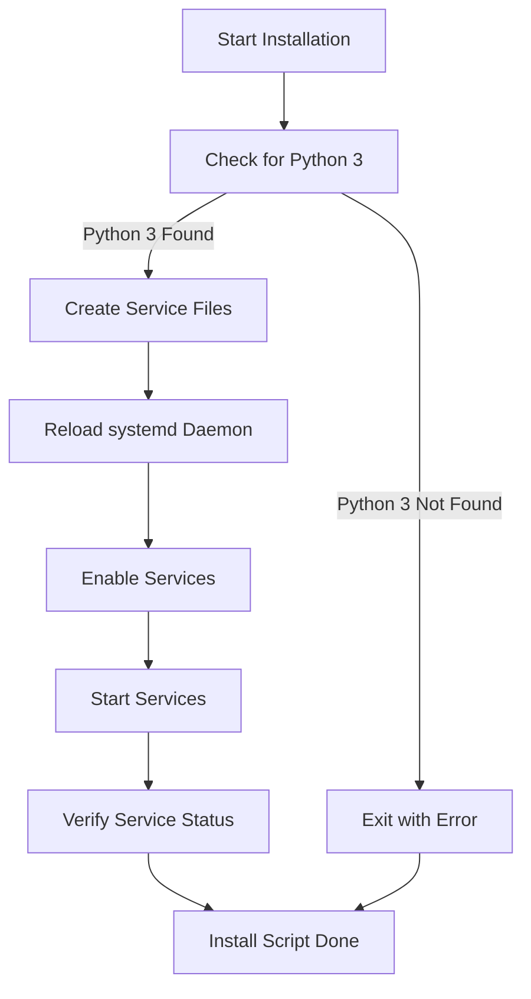
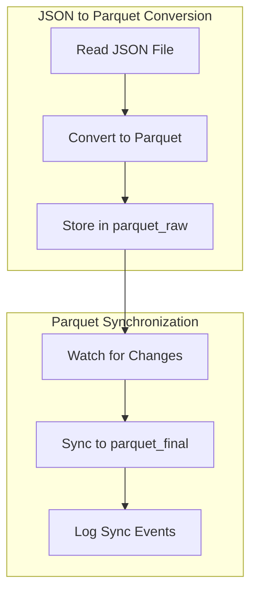
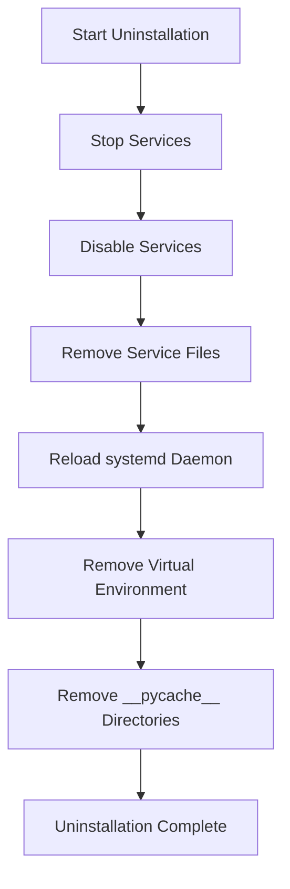

# JSON to Parquet ETL Services

This project includes two Python services: one for converting JSON files to Parquet format and another for synchronizing Parquet files between two directories. The services are designed to be robust, with comprehensive error checking, logging capabilities, and options for running in debug or production mode.

## Project Structure

```plaintext
.
├── src/                       # Source directory containing Python scripts and config file
│   ├── common_utils.py        # Common utility functions for logging and signal handling
│   ├── .env                   # Configuration file for setting paths and other variables
│   ├── json_to_parquet.py     # Service to convert JSON files to Parquet format
│   ├── parquet_sync.py        # Service to synchronize Parquet files between directories
│   ├── requirements.txt       # Python dependencies
├── install.sh                 # Installation script for setting up the services
├── uninstall.sh               # Uninstallation script to remove the services and virtual environment
├── cleanup.sh                 # Cleanup script to remove output and log files before each run
├── json_input/                # Directory for input JSON files
├── logs/                      # Directory for log files (created at runtime)
├── parquet_final/             # Directory for final synchronized Parquet files
├── parquet_raw/               # Directory for raw Parquet files before synchronization
└── documented_sample_run/     # Directory containing documented sample runs
    └── README.md              # Detailed explanation and log of a sample run
```

## Installation Flow

The installation process sets up the services to automatically run in production mode, logging all events to a file. Below is a flowchart describing the installation process.



## Service Architecture

The project includes two services:

1. **JSON to Parquet Conversion Service**: Converts JSON files to Parquet format and stores them in the `parquet_raw` directory.
2. **Parquet Synchronization Service**: Monitors the `parquet_raw` directory and synchronizes its contents with the `parquet_final` directory.

### Service Architecture Overview



### Example of ETL (Extract, Transform, Load)

- **Extract**: The JSON data is extracted from the `json_input` directory.
- **Transform**: The data is transformed from JSON format to Parquet format.
- **Load**: The transformed data is loaded into the `parquet_raw` directory, and then synchronized to the `parquet_final` directory.

## Uninstallation Flow

The uninstallation script removes the services, the virtual environment, and performs necessary cleanup.



## Third-Party Libraries and Frameworks

### 1. `pandas`
- **Purpose**: Used for data manipulation and conversion from JSON to Parquet format.
- **Reason for Use**: `pandas` is a powerful library for handling structured data and is widely used in data processing tasks.

### 2. `watchdog`
- **Purpose**: Monitors the filesystem for changes and triggers synchronization.
- **Reason for Use**: `watchdog` provides a simple and efficient way to watch for file system events in real-time, making it ideal for the synchronization service.

### 3. `argparse`
- **Purpose**: Handles command-line arguments to control verbosity and other options.
- **Reason for Use**: `argparse` is a standard library in Python that simplifies the handling of command-line arguments.

## Design Decisions and Limitations

### Design Decisions:
- **Logging**: The services use a centralized logging mechanism that can log both to the console and to files. This allows for flexible debugging and monitoring.
- **Signal Handling**: The services include signal handling to ensure graceful shutdowns, which is critical for maintaining data integrity.
- **Modularization**: Common functionalities like logging setup and signal handling are modularized into `common_utils.py` to avoid redundancy and improve maintainability.

### Limitations:
- **Single Threaded**: The services are currently single-threaded, which may become a bottleneck if the number of files or the size of the data grows significantly.
- **File System Dependency**: The synchronization relies on file system events, which may not be as efficient or reliable as a more robust data pipeline solution.

## Scalability and Potential Breakdowns

### How to Scale:
- **Parallel Processing**: Use multithreading or multiprocessing to handle multiple files simultaneously.
- **Distributed Systems**: Implement a distributed file system or use cloud-based storage solutions to manage larger datasets and synchronize across multiple nodes.
- **Event-Driven Architecture**: Integrate with message queues or event buses (e.g., Kafka) for more scalable and reliable file processing and synchronization.

### Potential Breakdowns:
- **Large Number of Files**: As the number of files grows, the single-threaded nature of the services may slow down processing.
- **File System Limits**: Operating system limits on file handles or file system performance may become a bottleneck.

## Deployment and Runtime Environment

### Deployment:
- **Systemd Services**: The services are deployed as `systemd` services on a Linux-based system, ensuring that they run automatically at startup and can be easily managed.
- **Production Mode**: By default, the services run in production mode, logging only to files for minimal system impact.

### Debugging:
- **Debug Mode**: You can switch to debug mode by stopping the services and running the Python scripts with the `--verbosity debug` flag. This will log events to both the console and log files, making it easier to trace issues.

### Runtime Environment:
- **Linux**: The services are designed to run on a Linux environment with Python 3 installed. They have been tested on Ubuntu.

### Upgrade / Improvement:
- **Kubernetes Hosted API**: This may be better served as a scalable ETL / API accepting the file & producing to a Kafka topic 'parquet_raw', consuming & transforming to 'parquet_final' and then a React front end to load & serve end results.

## Conclusion

This project provides a robust solution for converting JSON files to Parquet and synchronizing Parquet files across directories. The use of modular code, comprehensive error handling, and scalable design patterns makes it suitable for both small-scale and potentially larger-scale deployments, with options for further scaling and optimization.

