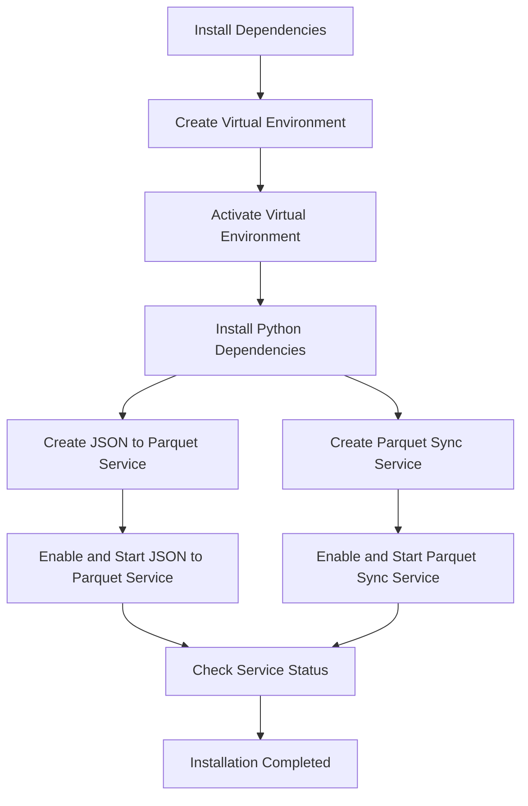

# Documented Sample Run of JSON to Parquet Conversion and Parquet Synchronization Services

This document provides a step-by-step overview of setting up and running the JSON to Parquet Conversion and Parquet Synchronization services. The process is illustrated with Mermaid diagrams for clarity.

## Installation and Setup

### Step 1: Install Dependencies and Setup Services
Run the `install.sh` script to install Python dependencies, create virtual environments, and set up the services.

```sh
$ ./install.sh
```

**Expected Output:**
```
Requirement already satisfied: python-dotenv in ./services/lib/python3.10/site-packages (from -r /root/interviews/cohere/src/requirements.txt (line 3)) (1.0.1)
Requirement already satisfied: pandas in ./services/lib/python3.10/site-packages (from -r /root/interviews/cohere/src/requirements.txt (line 4)) (2.2.2)
Requirement already satisfied: watchdog in ./services/lib/python3.10/site-packages (from -r /root/interviews/cohere/src/requirements.txt (line 5)) (4.0.2)
Requirement already satisfied: pyarrow in ./services/lib/python3.10/site-packages (from -r /root/interviews/cohere/src/requirements.txt (line 6)) (17.0.0)
Requirement already satisfied: pprintpp in ./services/lib/python3.10/site-packages (from -r /root/interviews/cohere/src/requirements.txt (line 8)) (0.4.0)
...
Created symlink /etc/systemd/system/multi-user.target.wants/parquet_sync.service → /etc/systemd/system/parquet_sync.service.
Checking the status of the services...
● parquet_sync.service - Parquet Synchronization Service
     Loaded: loaded (/etc/systemd/system/parquet_sync.service; enabled; vendor preset: enabled)
     Active: active (running) since Sun 2024-08-25 02:22:58 EDT; 584ms ago
   Main PID: 811898 (python3)
...
● json_to_parquet.service - JSON to Parquet Conversion Service
     Loaded: loaded (/etc/systemd/system/json_to_parquet.service; disabled; vendor preset: enabled)
     Active: active (exited) since Sun 2024-08-25 02:22:59 EDT; 12ms ago
...
Installation completed successfully.
```

### Mermaid Diagram: Service Setup Flow



### Step 2: Verify Service Status
Check the status of both services to ensure they are running as expected.

```sh
$ sudo systemctl status parquet_sync.service
$ sudo systemctl status json_to_parquet.service
```

### Step 3: Uninstall Services (Optional)
To uninstall the services, use the `uninstall.sh` script.

```sh
$ ./uninstall.sh
```

**Expected Output:**
```
Starting uninstallation of services...
Cleaning up parquet_raw directory...
Cleaning up parquet_final directory...
Cleaning up log files...
Cleanup completed. All output and log files have been removed.
Removed /etc/systemd/system/multi-user.target.wants/parquet_sync.service.
Uninstallation completed successfully.
```

### Step 4: Clean Up Files (Optional)
To clean up the generated files, use the `cleanup.sh` script.

```sh
$ ./cleanup.sh
```

**Expected Output:**
```
Cleaning up parquet_raw directory...
Cleaning up parquet_final directory...
Cleaning up log files...
Cleanup completed. All output and log files have been removed.
```

### Step 5: Verify JSON to Parquet Conversion
After running the service, check if the `iris.parquet` file was created correctly.

```sh
$ ls -la parquet_raw/
$ ls -la parquet_final/
```

### Step 6: Read and Verify the Parquet File
To ensure the Parquet file was generated correctly, read it using `pandas`.

```sh
$ python -c "import pandas as pd; df = pd.read_parquet('parquet_final/iris.parquet'); print(df)"
```

**Expected Output:**
```
     sepalLength  sepalWidth  petalLength  petalWidth    species
0            5.1         3.5          1.4         0.2     setosa
1            4.9         3.0          1.4         0.2     setosa
2            4.7         3.2          1.3         0.2     setosa
3            4.6         3.1          1.5         0.2     setosa
4            5.0         3.6          1.4         0.2     setosa
..           ...         ...          ...         ...        ...
145          6.7         3.0          5.2         2.3  virginica
146          6.3         2.5          5.0         1.9  virginica
147          6.5         3.0          5.2         2.0  virginica
148          6.2         3.4          5.4         2.3  virginica
149          5.9         3.0          5.1         1.8  virginica

[150 rows x 5 columns]
```

### Conclusion

This guide provides a complete walkthrough of setting up, running, and verifying the JSON to Parquet Conversion and Parquet Synchronization services. The provided Mermaid diagram helps visualize the flow of installation and service management.
